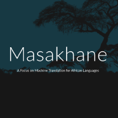

[![Contributors][contributors-shield]][contributors-url]
[![Forks][forks-shield]][forks-url]
[![Stargazers][stars-shield]][stars-url]
[![Issues][issues-shield]][issues-url]
[![MIT License][license-shield]][license-url]
[![LinkedIn][linkedin-shield]][linkedin-url]


<!-- PROJECT LOGO -->
<br />
<p align="center">
  <a href="https://github.com/espoirMur/masakhane_twitter_bot">
    
  </a>

  <h3 align="center">Masakhane Lingala Transaltor</h3>

  <p align="center">
    A twitter bot that use masakhane NMT model to translate your tweets from English to Lingala
    <br />
    <a href="https://github.com/espoirMur/masakhane_twitter_bot"><strong>Explore the docs »</strong></a>
    <br />
    <br />
    <a href="https://twitter.com/olobi_nini">View Demo</a>
    ·
    <a href="https://github.com/espoirMur/masakhane_twitter_bot">Report Bug</a>
    ·
    <a href="https://github.com/espoirMur/masakhane_twitter_bot">Request Feature</a>
  </p>
</p>


<!-- TABLE OF CONTENTS -->
## Table of Contents

* [About the Project](#about-the-project)
  * [Built With](#built-with)
* [Getting Started](#getting-started)
  * [Prerequisites](#prerequisites)
  * [Installation](#installation)
* [Usage](#usage)
* [Roadmap](#roadmap)
* [Contributing](#contributing)
* [License](#license)
* [Contact](#contact)
* [Acknowledgements](#acknowledgements)


<!-- ABOUT THE PROJECT -->
## About The Project

Masakhane is a open source started in September 2019 that aims to build translation models for African languages.

This project is a bot that use the English-Lingala MNT model from the project and help to translate your english tweets into Lingala

Lingala is one of the most spoken language in DRC , however only few language has been translated into eat. It's even hard to translate local languages to Lingala.
That is why I thought it may be useful to translate English to Lingala.

This bot help you to translate your english tweets into Lingala tweets , in the future it will integrate many languages and will perform a reverse translation.

### Built With

* [Python](https://www.python.org/)
* [Tweepy](https://github.com/tweepy/tweepy)
* [JoeyMNT](https://github.com/joeynmt/joeynmt)


<!-- GETTING STARTED -->
## Getting Started

To get a local copy up and running follow these simple steps.

### Prerequisites

To run this project make sure you have Python 3.6.5 installed in your laptop

### Installation
 
1. Clone the masakhane_twitter_bot
```sh
git clone https://github.com/espoirMur/masakhane_twitter_bot.git
```
2. Install requirements

- Joey Mnt installation
```sh
pip install git+https://github.com/joeynmt/joeynmt.git
```

- Install other requirement using : 

```sh
pip install -r requirements.txt
```

3. Get Twitter Application credentials

Follow [this guide](https://docs.inboundnow.com/guide/create-twitter-application/) to create twitter application credentials. You need to have a twitter developer certified account. 

4. Create Environnement Variables

Update the file sample.env with your credentials from twitter and copy it to .env

```sh
cp sample.env ./.env
```


<!-- USAGE EXAMPLES -->

## Customize to serve your model

If you are a developer working on a translation using [JOEYMNT](https://github.com/joeynmt/joeynmt) and would like to create a similar bot give the following file : 

* Your model : A checkpoint file named `best.ckpt`  should be in the
`transformer` older 
* The source and target vocabulary named `src_vocab.txt` and `trg_vocab.txt `
 should be in the `transformer` folder.
 
 * You don't need to change the config.yaml if you have a BPE based
 model.
 
 
 ----
The model can be quite big and Github have restrictions on the size of your 
free repos. You can host your model on google drive as I do. 
If you want to try the English to Lingala model :blush: , you can download it [here](https://doc-0s-c8-docs.googleusercontent.com/docs/securesc/0u5lc4r8e47cple7erfa6ppuo8n82d8t/vm485f63cg23jn7rfl1t58fbbm2vibqj/1581696900000/15488196668578569179/15488196668578569179/1w-4aejEmCVpqIAa7xYw2sJVfMLNMVeKK?e=download&authuser=0&nonce=a9j5oal5217rq&user=15488196668578569179&hash=omnhlmg1rc1cvtp2iv3r58vo18gkum8i)


<!-- ROADMAP -->
## Roadmap

Here is what We can do :

- [] Add as many models as we can
- [] Perform the reverse translation
- [] Improve the model accuracy
- [] What Else? More features to come


<!-- CONTRIBUTING -->
## Contributing

Contributions are what make the open source community such an amazing place to be learn, inspire, and create. Any contributions you make are **greatly appreciated**.

1. Fork the Project
2. Create your Feature Branch (`git checkout -b feature/AmazingFeature`)
3. Commit your Changes (`git commit -m 'Add some AmazingFeature'`)
4. Push to the Branch (`git push origin feature/AmazingFeature`)
5. Open a Pull Request


<!-- LICENSE -->
## License

Distributed under my personal open source licence. See `LICENSE` for more information.


<!-- CONTACT -->
## Contact

Espoir - [@olobi_nini](https://twitter.com/olobi_nini) - espoir.mur on gmail

Project Link: [https://github.com/espoirMur/masakhane_twitter_bot](https://github.com/espoirMur/masakhane_twitter_bot)


<!-- ACKNOWLEDGEMENTS -->
## Acknowledgements

* [Jade Abott](https://github.com/jaderabbit) For starting Masakhane project
* [Julia Kreutzer](https://github.com/juliakreutzer) For creating joeymnt
* [Kevin Degila](https://github.com/kevindegila/) For creating [Flask-Joey](https://github.com/kevindegila/flask-joey)
* [My Self](https://github.com/espoirMur/) For the Hard Work Done :muscle:
* [Yourself ](https://github.com/YourGithub/) for your feedback, critique and contribution


<!-- MARKDOWN LINKS & IMAGES -->
<!-- https://www.markdownguide.org/basic-syntax/#reference-style-links -->
[contributors-shield]: https://img.shields.io/github/contributors/othneildrew/Best-README-Template.svg?style=flat-square
[contributors-url]: https://github.com/espoirMur/masakhane_twitter_bot/graphs/contributors
[forks-shield]: https://img.shields.io/github/forks/othneildrew/Best-README-Template.svg?style=flat-square
[forks-url]: https://github.com/espoirMur/masakhane_twitter_bot/network/members
[stars-shield]: https://img.shields.io/github/stars/othneildrew/Best-README-Template.svg?style=flat-square
[stars-url]: https://github.com/espoirMur/masakhane_twitter_bot/stargazers
[issues-shield]: https://img.shields.io/github/issues/othneildrew/Best-README-Template.svg?style=flat-square
[issues-url]: https://github.com/espoirMur/masakhane_twitter_bot/issues
[license-shield]: https://img.shields.io/github/license/othneildrew/Best-README-Template.svg?style=flat-square
[license-url]: https://github.com/espoirMur/masakhane_twitter_bot/blob/master/LICENSE.md
[linkedin-shield]: https://img.shields.io/badge/-LinkedIn-black.svg?style=flat-square&logo=linkedin&colorB=555
[linkedin-url]: https://www.linkedin.com/in/murhabazi-buzina-espoir-7849b1b1/
[product-screenshot]: images/screenshot.png
